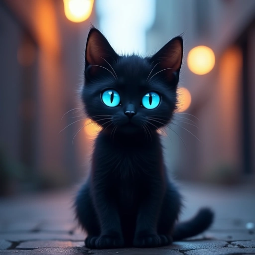
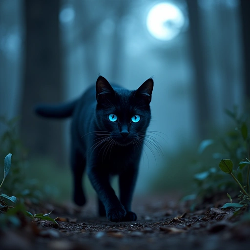
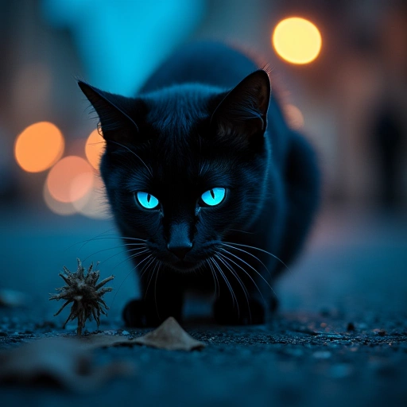
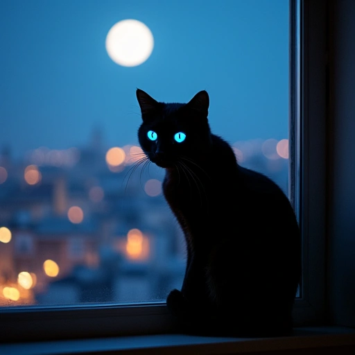
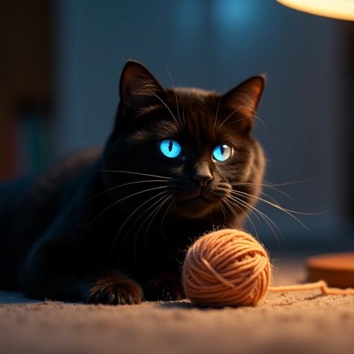

# Image Generator IA
par Viggo Casciano

# Le sujet
Voici le sujet :
- Créer un code Python qui prend en entrée un prompt d'un **utilisateur**.
- Ce prompt doit être _renforcé_ par un LLM au choix mis à disposition par Novita.
- Ensuite, le prompt renforcé doit être envoyé à une IA générative d'image appelée Black Forest pour générer une image.

## 1. Mise en place du projet :

### 1.1 Récupération du projet :
Veuillez avant toute chose récupérer le projet via ce lien GitHub avec la commande :

```sh
git clone https://github.com/shvvkz/Image-Generator-IA.git
cd Image-Generator-IA
```

### 1.2 Mise en place de l'environnement virtuel :
Pour créer un environnement virtuel, veuillez exécuter cette commande :
```sh
python -m venv venv
```

Ensuite, nous allons activer cet environnement virtuel avec cette commande :

**Pour Linux :**
```sh
source venv/bin/activate
```

**Pour Windows :**
```sh
venv\Scripts\activate
```

### 1.3 Récupération des clés d'API

Avant tout, il vous faut faire une copie du fichier `.env.example` et renommer cette copie en **.env**, celui-ci devrait ressembler à ça :
```txt
NOVITA_API_KEY=
NEBIUS_API_KEY=
```
Pour ce projet, vous avez besoin de générer deux clés d'API :
- Une clé de **Novita**, qui va nous permettre de générer un prompt amélioré.
- Une clé de **Nebius**, qui va nous permettre de générer l'image.

Pour ce faire, rendez-vous sur ces deux liens :
- Novita : [Création d'API pour Novita](https://novita.ai/settings/key-management?utm_source=getstarted)
- Nebius : [Création d'API pour Nebius](https://nebius.com/settings/api-keys)

Vous allez devoir vous créer un compte sur chacun des deux sites pour pouvoir générer une image.

#### 1.3.1 Générer une clé d'API sur Novita
Rendez-vous sur le lien ci-dessus après avoir créé votre compte, puis :
- Cliquez sur **Add New Key**
- Entrez un nom pour votre clé d'API (exemple : Novita)
- Appuyez sur **Copy**
- Collez le contenu dans le fichier **.env** à droite de _NOVITA_API_KEY=_

Le contenu de votre fichier **.env** devrait être :
```txt
NOVITA_API_KEY=sk_xxxxxxxxxxxxxxxxxxxxxxxxxxxxxxxxxxxxxxxxxxx
NEBIUS_API_KEY=
```

#### 1.3.2 Générer une clé d'API sur Nebius
Rendez-vous sur le lien ci-dessus après avoir créé votre compte, puis :
- Cliquez sur **Create API Key**
- Entrez un nom pour votre clé d'API (exemple : Nebius)
- Appuyez sur **Copy**
- Collez le contenu dans le fichier **.env** à droite de _NEBIUS_API_KEY=_

Le contenu de votre fichier **.env** devrait être :
```txt
NOVITA_API_KEY=sk_xxxxxxxxxxxxxxxxxxxxxxxxxxxxxxxxxxxxxxxxxxx
NEBIUS_API_KEY=xxxxxxxxxxxxxxxxxxxxxxxxxxxxxxxxxxxxxxxxxxxxxxxxxxxxxxxxxxxx
```

### 1.4 Installation des dépendances :
Pour installer les dépendances du projet, exécutez cette commande :
```sh
pip install -r requirements.txt
```
Cela va installer les packages suivants :
- huggingface-hub : facilite les interactions avec les API des IA
- dotenv : permet de gérer les variables d'environnement
- pillow : permet de générer une image à partir d'une Bitmap
- streamlit : permet de créer une application web interactive

## 2. Utilisation de l'outil :

Une fois que vous avez configuré votre environnement et installé les dépendances, vous pouvez exécuter le script pour générer un prompt amélioré grâce à l'IA.

Pour exécuter l'application, utilisez la commande suivante dans un terminal à la racine du projet :

```sh
streamlit run app.py
```

Cette commande lancera automatiquement l'application web dans votre navigateur par défaut, à l'adresse suivante :

```
http://localhost:8501
```

Une fois l'application ouverte, vous verrez une interface simple où vous pouvez choisir un modèle de LLM (vous pouvez laisser le champ inchangé) et saisir un prompt dans un champ de texte.

Par exemple :
```
Un chat assis sous un arbre
```

Cliquez ensuite sur le bouton **"✨ Générer les images"**.

L'application va alors :
1. Envoyer ce prompt à l'IA **Novita** pour le transformer en 5 prompts plus riches et descriptifs.
2. Afficher les prompts améliorés sous forme de JSON.
3. Utiliser **Nebius** pour générer une image à partir de chacun de ces 5 prompts.
4. Afficher toutes les images directement dans l'interface web.

Exemple de résultat JSON :
```json
{
  "enhanced_prompts": [
    "Un chat majestueux avec un pelage doré est assis sous un vieux chêne, baigné par la lumière dorée du coucher de soleil.",
    "Un chat noir aux yeux émeraude se repose paisiblement sous un arbre en fleurs, alors que des pétales roses tombent doucement autour de lui.",
    "Un chat roux joueur bondit entre les racines noueuses d'un arbre gigantesque dans une forêt mystérieuse, illuminée par une lueur féerique.",
    "Un petit chat tigré s'assoit sous un pommier, contemplant les pommes rouges qui pendent au-dessus de lui, tandis qu'une brise légère fait danser les feuilles.",
    "Un chat siamois au regard perçant est blotti sous un cerisier en fleurs, dans un jardin japonais paisible avec une rivière sinueuse."
  ]
}
```

Chaque image générée sera affichée dans une grille juste en dessous. Les fichiers seront aussi sauvegardés localement dans un dossier `image_generated/{uid}/` pour un accès ultérieur.

## 3. Problèmes et solutions :

Si vous rencontrez des erreurs lors de l'exécution du script, voici quelques solutions possibles :

### 3.1 Clés d'API non reconnues :
Si vous voyez un message d'erreur indiquant que les clés d'API sont invalides ou absentes, assurez-vous que votre fichier `.env` est bien configuré et contient les clés correctes.
```txt
NOVITA_API_KEY=sk_xxxxxxxxxxxxxxxxxxxxxxxxxxxxxxxxxxxxxxxxxxx
NEBIUS_API_KEY=xxxxxxxxxxxxxxxxxxxxxxxxxxxxxxxxxxxxxxxxxxxxxxxxxxxxxxxxxxxx
```

### 3.2 Problèmes avec l'installation des dépendances :
Si une erreur indique qu'un module est manquant, vérifiez que toutes les dépendances sont bien installées avec :
```sh
pip install -r requirements.txt
```

### 3.3 Erreur JSON :
Si l'IA ne renvoie pas un JSON valide, le programme réessayera 3 fois mais si l'erreur persiste, veuillez relancer le programme.

## 4. Améliorations possibles :

Voici quelques pistes d'amélioration pour le projet :
- Ajouter des filtres artistiques aux images générées.

## 5. Exemples :

Prompt original : **A cute black cat in the night with blue neon eyes**

#### 6.1 A cute black cat with soft fur and expressive blue neon eyes, sitting in a quiet urban alley under the glow of street lamps, with a mysterious and curious gaze



#### 6.2 A sleek black cat with glowing blue eyes, walking through a moonlit forest, its fur catching the light as it moves gracefully.



#### 6.3 In the dead of night, a black cat with striking blue neon eyes investigates an intriguing object on a dark street, its surroundings illuminated by distant city lights.



#### 6.4 A black cat with enchanting blue neon eyes perches on a windowsill, its gaze fixed on the moonlit cityscape below, exuding a sense of calm and watchfulness.



#### 6.5 A black cat with glowing blue eyes plays with a ball of yarn in a dimly lit room, its soft fur illuminated by a single lamp, creating a warm and cozy atmosphere.

